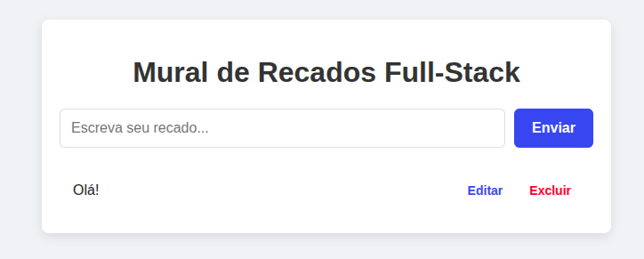

Mural de Recados Full-Stack📝 DescriçãoEste é um projeto de "Hello World" para um ambiente de desenvolvimento full-stack recém-configurado no Linux Mint. A aplicação consiste em um mural de recados simples que permite criar, ler, atualizar e deletar mensagens (CRUD), demonstrando a integração completa entre frontend, backend e um banco de dados relacional.O objetivo principal é validar a instalação e a comunicação entre todas as ferramentas essenciais de um desenvolvedor.🛠️ Tecnologias UtilizadasBackend:Python 3Flask (para a API REST)MySQL ConnectorPython-dotenv (para gerenciar variáveis de ambiente)Frontend:HTML5CSS3JavaScript (Vanilla, com Fetch API)Banco de Dados:MySQLAmbiente:Linux MintGit & GitHubVisual Studio Code📂 Estrutura do Projetomural-de-recados/
├── .env                  # Arquivo com as variáveis de ambiente (senha do BD)
├── .gitignore            # Arquivos e pastas a serem ignorados pelo Git
├── README.md             # Este arquivo
├── requirements.txt      # Dependências do Python
├── backend/
│   └── app.py            # Servidor Flask com a lógica da API
├── database/
│   └── schema.sql        # Script para criação do banco de dados e tabela
└── frontend/
    ├── css/
    │   └── style.css     # Estilização da página
    ├── js/
    │   └── script.js     # Lógica do frontend e chamadas para a API
    └── index.html        # Estrutura da página
🚀 Como Executar o ProjetoSiga os passos abaixo para rodar a aplicação localmente.Pré-requisitosPython 3 instaladoMySQL Server instaladoGit instaladoPassosClone o repositório:git clone [https://github.com/SEU-USUARIO/mural-de-recados.git](https://github.com/SEU-USUARIO/mural-de-recados.git)
cd mural-de-recados
Crie e configure o banco de dados:Acesse o MySQL com seu usuário root:mysql -u root -p
Execute o script schema.sql para criar o banco de dados e a tabela:SOURCE database/schema.sql;
exit;
Configure as variáveis de ambiente:Crie uma cópia do arquivo .env.example (se existir) ou crie um novo arquivo chamado .env na raiz do projeto.Adicione sua senha do MySQL ao arquivo:DB_PASSWORD="SUA_SENHA_DO_MYSQL_AQUI"
Crie e ative o ambiente virtual:python3 -m venv venv
source venv/bin/activate
Instale as dependências do Python:pip install -r requirements.txt
Inicie o servidor backend:python3 backend/app.py
Acesse a aplicação:Abra seu navegador e acesse http://127.0.0.1:5000.Desenvolvido por Juan Ferreira dos Santos.
